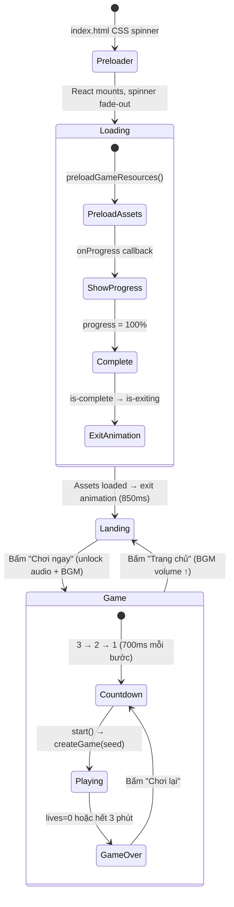
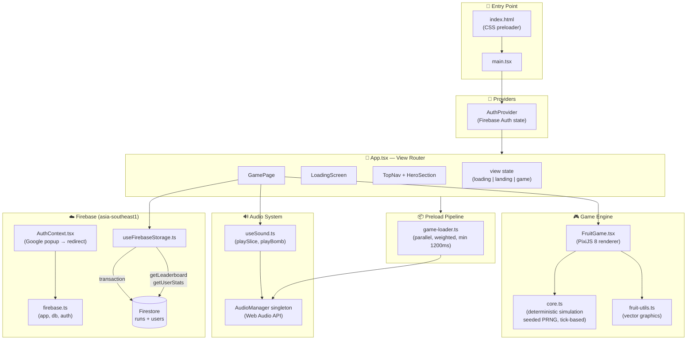
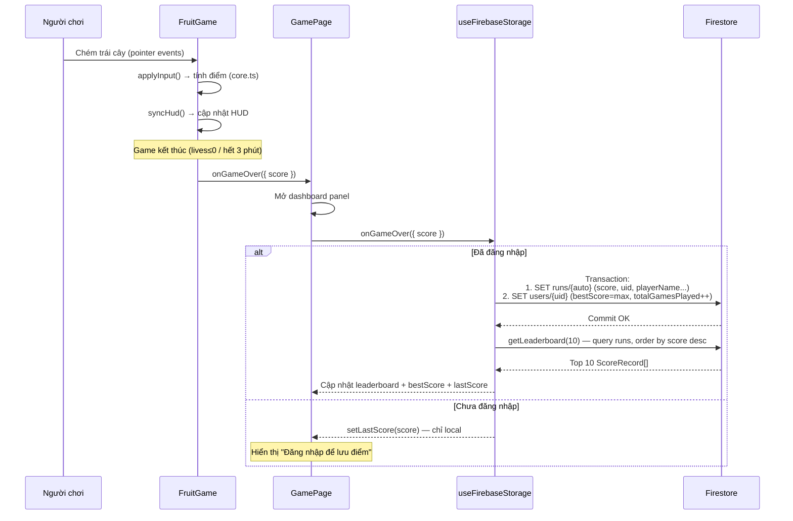
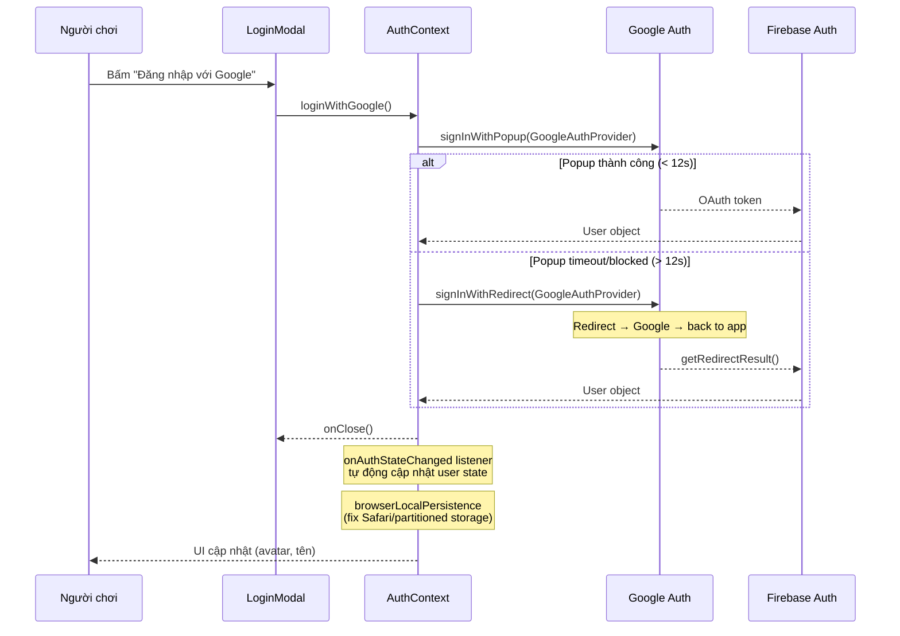
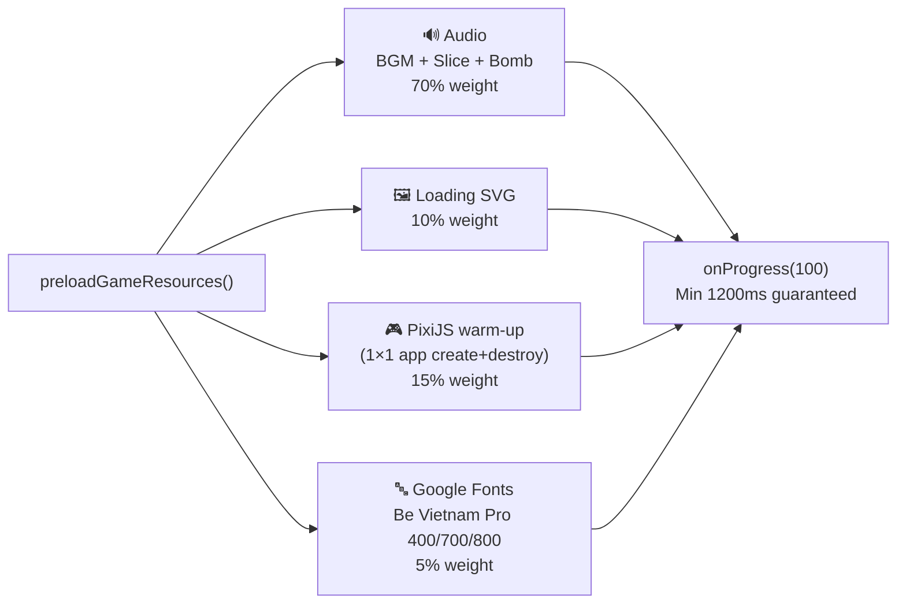

# 🏗️ Architecture — Chém Lạc Vùng Cao

> Mini game chém trái cây phong cách làng quê Việt Nam, xây bằng React + PixiJS + Firebase.
> Chủ đề: **Bộ Lạc Đậu Phộng** — aesthetic đồng quê Việt Nam (lá tre, lúa, nón lá).

---

## Mục lục

1. [Cách chạy dự án](#1-cách-chạy-dự-án)
2. [Công nghệ sử dụng](#2-công-nghệ-sử-dụng)
3. [Cấu trúc thư mục](#3-cấu-trúc-thư-mục)
4. [Luồng dữ liệu tổng quan](#4-luồng-dữ-liệu-tổng-quan)
5. [Chi tiết từng module](#5-chi-tiết-từng-module)
6. [Game Engine (core.ts)](#6-game-engine-corets)
7. [Firebase & Backend](#7-firebase--backend)
8. [Asset Pipeline](#8-asset-pipeline)
9. [Deployment](#9-deployment)

---

## 1. Cách chạy dự án

### Yêu cầu

- **Node.js** ≥ 20
- **pnpm** (hoặc npm)
- (Tùy chọn) **Firebase CLI** nếu muốn chạy emulator hoặc deploy

### Cài đặt

```bash
# Clone và cài dependencies
cd "Speed Click Game"
pnpm install

# Tạo file biến môi trường
cp .env.example .env
# → Điền các giá trị Firebase config vào .env
```

### Biến môi trường (`.env`)

| Biến | Mô tả |
|------|--------|
| `VITE_FIREBASE_API_KEY` | API key Firebase |
| `VITE_FIREBASE_AUTH_DOMAIN` | Auth domain |
| `VITE_FIREBASE_PROJECT_ID` | Project ID (mặc định: `fruit-games-79f91`) |
| `VITE_FIREBASE_STORAGE_BUCKET` | Storage bucket |
| `VITE_FIREBASE_MESSAGING_SENDER_ID` | Messaging sender ID |
| `VITE_FIREBASE_APP_ID` | App ID |
| `VITE_FIREBASE_MEASUREMENT_ID` | Google Analytics ID |
| `VITE_FIREBASE_APP_CHECK_SITE_KEY` | App Check reCAPTCHA site key |

### Chạy development

```bash
# Chạy dev server (port 5173)
pnpm dev
```

### Các lệnh khác

```bash
pnpm build        # Build production (vite build) → dist/
pnpm typecheck    # Kiểm tra TypeScript (tsc --noEmit)
pnpm test         # Chạy unit tests (vitest run src)
pnpm test:watch   # Chạy tests ở watch mode
```

### Chạy Firebase emulators

```bash
# Khởi động emulators
firebase emulators:start
# → Auth emulator:      localhost:9099
# → Firestore emulator:  localhost:8080
# → Emulator UI:         localhost:4000
```

### Chạy Reset Leaderboard (Admin)

```bash
pnpm reset:leaderboard -- fruit-games-79f91 --confirm-delete
```

---

## 2. Công nghệ sử dụng

| Layer | Công nghệ | Phiên bản |
|-------|-----------|-----------|
| UI Framework | React | 18.3.1 |
| Game Renderer | PixiJS | 8.19.0 |
| Build Tool | Vite | 6.3.5 |
| CSS Framework | Tailwind CSS | 4.1.12 |
| Language | TypeScript | 5.8.3 |
| Backend | Firebase (Auth, Firestore) | 12.14.0 |
| Icons | Lucide React | 0.487.0 |
| Animations | tw-animate-css | 1.3.8 |
| Testing | Vitest | 3.2.4 |
| Hosting | Firebase Hosting + Vercel | — |

---

## 3. Cấu trúc thư mục

```
Speed Click Game/
├── index.html                  # Entry HTML — SEO meta, CSS preloader spinner, font preload
├── vite.config.ts              # Vite config (figma asset resolver, React, Tailwind v4)
├── tsconfig.json               # TypeScript config (strict, path alias @/)
├── package.json                # Scripts & dependencies (@figma/my-make-file)
├── firebase.json               # Firebase hosting + Firestore + emulators config
├── firestore.rules             # Firestore security rules (server-authoritative)
├── firestore.indexes.json      # Composite indexes (hiện tại: trống)
├── vercel.json                 # Vercel SPA config + cache headers
├── .firebaserc                 # Firebase project: fruit-games-79f91
├── .env / .env.example         # Biến môi trường Firebase
│
├── public/
│   ├── favicon.svg             # Site favicon (1.3KB)
│   └── assets/
│       ├── moavii-we-are.mp3           # 🎵 Nhạc nền BGM (~4.9MB)
│       ├── 666herohero-slash-21834.mp3 # 🔪 Hiệu ứng chém (~12KB)
│       ├── bomb.mp3                    # 💣 Hiệu ứng bom (~6KB)
│       ├── music.mp3                   # 🎵 File nhạc dự phòng (~2.9MB)
│       └── slashing-fruit-loading.svg  # 🖼️ Ảnh loading screen (~2.3MB)
│
├── src/
│   ├── main.tsx                # React entry — removes #preloader, mounts AuthProvider+App
│   │
│   ├── styles/
│   │   ├── index.css           # Imports: fonts.css, tailwind.css, theme.css
│   │   ├── fonts.css           # Google Fonts import: Be Vietnam Pro (400,700,800)
│   │   ├── tailwind.css        # Tailwind v4 + tw-animate-css, source(none)
│   │   └── theme.css           # 🎨 Design tokens, shadcn/ui compat, game button primitives
│   │
│   ├── lib/
│   │   └── firebase.ts         # Firebase init, Auth/Firestore helpers
│   │                           # → exports: auth, db, loginWithGoogle,
│   │                           #   signUpWithEmail, signInWithEmail, logout,
│   │                           #   getLeaderboard, getUserStats, ScoreRecord
│   │
│   ├── game/
│   │   ├── core.ts             # 🎮 Game engine — deterministic, tick-based, seeded PRNG
│   │   └── core.test.ts        # Unit tests (determinism, scoring, combo, lives, input validation)
│   │
│   └── app/
│       ├── App.tsx             # 🎯 Root component — view router (loading → landing → game)
│       │
│       ├── components/
│       │   ├── LoadingScreen.tsx    # Màn loading (progress bar, 24 lá rơi, 42 lá nổ)
│       │   ├── LoadingScreen.css    # Styles + 9 keyframe animations + exit transition
│       │   ├── HeroSection.tsx      # Landing hero (title, CTA "Chơi ngay", staggered entrance)
│       │   ├── HeroBackdrop.tsx     # SVG đồng quê (núi, ruộng, tre, cò, cánh diều)
│       │   ├── TopNav.tsx           # Navigation bar (logo, brand, mute, login/logout)
│       │   ├── GamePage.tsx         # Container game (top bar, settings panel, leaderboard)
│       │   ├── FruitGame.tsx        # 🎮 PixiJS canvas — game loop, rendering, input, effects
│       │   └── LoginModal.tsx       # Modal đăng nhập Google + Guest + Email
│       │
│       ├── hooks/
│       │   ├── useSound.ts              # Hook SFX (playSlice, playBomb, polyphonic)
│       │   └── useFirebaseStorage.ts    # Hook lưu/đọc điểm qua Firestore transaction
│       │
│       ├── lib/
│       │   └── AuthContext.tsx       # React Context Firebase Auth (Google popup→redirect fallback)
│       │
│       ├── config/                   # (trống — dự kiến cho constants)
│       │
│       └── utils/
│           ├── audio-manager.ts     # Singleton Web Audio API (BGM loop, SFX polyphonic pools)
│           ├── fruit-utils.ts       # PixiJS procedural vector graphics cho 7 loại trái cây
│           └── game-loader.ts       # Preload toàn bộ assets (audio 70%, Pixi 15%, ảnh 10%, fonts 5%)
│
├── scripts/
│   └── reset-leaderboard.mjs  # Admin script xóa toàn bộ leaderboard
│
└── tests/                      # (trống — tests nằm trong src/game/core.test.ts)
```

---

## 4. Luồng dữ liệu tổng quan

### 4.1. Luồng điều hướng (View Flow)



### 4.2. Kiến trúc tổng quan



### 4.3. Luồng điểm số (Score Data Flow) — Server-Authoritative



> **⚠️ Lưu ý**: Score writes được thực hiện trực tiếp từ client qua Firestore transaction. Yêu cầu update `firestore.rules` để cho phép thao tác tạo mới document an toàn.

### 4.4. Luồng xác thực (Auth Flow)



---

## 5. Chi tiết từng module

### 5.1. `App.tsx` — Bộ điều phối trung tâm

**Vai trò**: Quản lý view state và orchestrate toàn bộ luồng ứng dụng.

| State | Type | Mô tả |
|-------|------|--------|
| `view` | `"loading" \| "landing" \| "game"` | Màn hình hiện tại |
| `loadingProgress` | `number` | Tiến độ loading (0–100) |
| `resourcesReady` | `boolean` | Tất cả assets đã load xong |
| `loadingExiting` | `boolean` | Đang chạy animation thoát loading |
| `showLogin` | `boolean` | Hiện modal đăng nhập |
| `muted` | `boolean` | Tắt âm thanh |

**Luồng xử lý**:

```
Mount → preloadGameResources() → resourcesReady=true → progress=100
  → LoadingScreen onDone → loadingExiting=true → 850ms delay → view="landing"

Bấm "Chơi ngay" → audioManager.unlock() + playBgm(0.2) → view="game"
  → FruitGame tự countdown 3→2→1 → game bắt đầu

Bấm "Trang chủ" → setBgmVolume(0.7) → refreshLeaderboard() → view="landing"
```

### 5.2. `LoadingScreen` — Màn hình tải

**Mục đích**: Load toàn bộ assets (audio, fonts, PixiJS warm-up, hình ảnh) một lần duy nhất.

**CSS Classes trạng thái**:
| Class | Khi nào | Hiệu ứng |
|-------|---------|-----------|
| `.screen-loading` | Mặc định | Hiển thị progress bar, lá rơi |
| `.is-complete` | `progress = 100%` | Burst 42 lá, pill "✓ Xong rồi", white flash |
| `.is-exiting` | Chuyển sang landing | Fade out + blur + scale 850ms |

**Hiệu ứng CSS**:
- 24 ambient leaves rơi liên tục (`leaf-fall` + `leaf-sway`)
- 42 burst leaves nổ tung khi hoàn tất (`leaf-burst`)
- Progress bar: gradient fill + `loading-shine` + sprout tip (`sprout-bob`)
- Exit: `loadingExit` (fade+blur+scale), `loadingContentExit` (slide up), `loadingPillExit`
- `prefers-reduced-motion`: tắt toàn bộ animation

### 5.3. `FruitGame.tsx` — Canvas game chính (491 dòng)

**Kiến trúc PixiJS**:

```
Pixi Stage
├── Background Layer (Container)
│   └── Sprite (from drawBackground — sky, hills, bamboo, birds, grass)
├── Play Layer (Container)
│   ├── Fruit Sprites (mỗi quả trong game state)
│   └── Particle Sprites (juice splat, fruit halves)
└── Trail Graphics (vệt chém: white outer + orange inner, 220ms fade)
```

**Game Loop** (`tick` function — chạy mỗi frame ở ~60fps):

```
1. advanceToTick(state, currentTick)    → Spawn fruits, apply physics
2. syncFruitSprites(state)              → Update sprite positions & rotation
3. syncHud(state) (mỗi ~250ms)         → Update React HUD overlay
4. Update particles                      → Gravity, alpha decay, cleanup
5. Update shake effect (400ms)           → Camera shake khi chém bom
6. Render trail                          → Vẽ vệt chém (dual-stroke line)
```

**Pointer handling**:

```
pointerdown/pointermove
  → handlePointer(clientX, clientY)
  → Tính screen coords (canvas rect transform)
  → Lưu trail point (max 18 points, fade 220ms)
  → normalizePointer() → InputSample (0-10000 range)
  → applyInput(state, sample) → SliceResult[]
  → Với mỗi result:
      Bomb? → spawnSplat(red+yellow+black, 150 particles) + shake + flashRed + "BÙM!" text
      Fruit? → 2 halves (perpendicular velocity) + juice splat + "+N" point text
  → syncFruitSprites() + syncHud()
  → state.ended? → finishGame()
```

**Textures** (generated at mount time, NOT image files):
```
Mỗi fruit kind → makeFruit(kind, radius)  → full Texture
                → makeHalf(kind, radius, "left")  → left half Texture
                → makeHalf(kind, radius, "right") → right half Texture
Circle particle → white filled circle Texture
```

**Responsive**: `ResizeObserver` → resize renderer + redraw background + re-sync sprites

### 5.4. `GamePage.tsx` — Container game

**Layout**:

```
┌──────────────────────────────────────┐
│ [🏠 Trang chủ]  Chém Lạc Vùng Cao  [🏆 Bảng điểm][⚙️ Cài đặt] │  ← Top bar
├──────────────────────────────────────┤
│                                      │
│            FruitGame                 │  ← PixiJS canvas (flex: 1)
│            (fills remaining space)   │
│                                      │
│                        ┌──────────┐  │
│                        │ Settings │  │  ← Overlay panel (absolute, top-right)
│                        │ hoặc     │  │
│                        │ Dashboard│  │
│                        └──────────┘  │
└──────────────────────────────────────┘
```

**Panels** (toggle via top bar buttons):
- **Settings**: Mute toggle + thống kê (điểm cao, điểm gần nhất, tổng lượt chơi, cấp bậc)
- **Dashboard**: Bảng vinh danh top 10 (🥇🥈🥉), highlight bản thân, verifying status, save errors, login prompt cho guest

**Hành vi**: Auto-opens dashboard khi game over, refresh leaderboard khi mở dashboard.

**Cấp bậc** (`rankFor(score)`):
| Điểm | Cấp bậc |
|------|---------|
| ≥ 400 | Vua Chém 👑 |
| ≥ 250 | Cao Thủ ⚔️ |
| ≥ 100 | Lính Mới 🌱 |
| < 100 | Tập Sự 🌾 |

### 5.5. `useFirebaseStorage` — Hook lưu trữ điểm

```typescript
// State
bestScore: number          // Điểm cao nhất (từ Firestore users/{uid})
lastScore: number | null   // Điểm lần chơi gần nhất
totalGamesPlayed: number   // Tổng lượt chơi (từ Firestore)
leaderboard: ScoreRecord[] // Top 10 từ Firestore runs collection
saveError: string | null   // Lỗi Vietnamese khi lưu
savingScore: boolean       // Đang lưu điểm

// Actions
beginGame()           → { seed: crypto.getRandomValues() }
onGameOver(result)    → chạy Firestore transaction trực tiếp
refreshLeaderboard()  → getLeaderboard(10) → query runs collection
```

**Error handling**: Dịch Firebase errors sang tiếng Việt:
- `permission-denied` / `unauthenticated` → "Phiên đăng nhập đã hết hạn..."
- `unavailable` / `network` → "Không có kết nối tới máy chủ..."
- Khác → "Không thể lưu điểm lúc này..."

### 5.6. `AudioManager` — Singleton quản lý âm thanh

```
┌─────────────────────────────────────────────┐
│ AudioContext                                │
│  ├── BGM: AudioBufferSourceNode (loop)      │
│  │   └── bgmGain → destination              │
│  │                                          │
│  ├── Slice SFX: polyphonic (max 5 voices)   │
│  │   └── gain → destination                 │
│  │                                          │
│  └── Bomb SFX: polyphonic (max 3 voices)    │
│       └── gain → destination                │
│                                             │
│  Voice pool management:                     │
│    Nếu vượt maxVoices → stop source cũ nhất │
│    source.onended → cleanup khỏi pool       │
└─────────────────────────────────────────────┘

Audio files (from /assets/):
  BGM:   moavii-we-are.mp3 (~4.9MB, loop)
  Slice: 666herohero-slash-21834.mp3 (~12KB, one-shot)
  Bomb:  bomb.mp3 (~6KB, one-shot)

Autoplay strategy:
  1. tryAutoPlayBgm() → tạo AudioContext, thử play ngay
  2. Nếu bị block (autoplay policy) → đợi click/touch/keydown → resume + play
  3. unlock() phải gọi từ user gesture cho mobile
```

---

## 6. Game Engine (`core.ts`)

### Thiết kế: Deterministic Tick-Based Simulation

Game engine hoàn toàn **deterministic** — cùng `seed` + cùng `InputSample[]` sẽ cho cùng kết quả. Engine độc lập và không chứa side-effects, sẵn sàng cho việc tính toán đồng bộ mọi nơi.

### Constants

| Hằng số | Giá trị | Mô tả |
|---------|---------|--------|
| `GAME_DURATION_MS` | 180,000 | Thời gian chơi (**3 phút**) |
| `TICK_RATE` | 60 | Ticks per second |
| `TICK_MS` | 16.67 | Thời gian mỗi tick (~60fps) |
| `WORLD_WIDTH` | 1000 | Chiều ngang thế giới game |
| `WORLD_HEIGHT` | 600 | Chiều cao thế giới game |
| `MAX_INPUT_SAMPLES` | 6000 | Giới hạn input để chống abuse |
| `GRAVITY` | 1000 | Gia tốc rơi (px/s²) |

### Scoring

| Loại trái | Điểm cơ bản | Radius |
|-----------|-------------|--------|
| 🥜 Đậu phộng (peanut) | 10 × 10 (bonus) = **100** | 28 |
| 🦔 Sầu riêng (durian) | 5 | 38 |
| 🐉 Thanh long (dragonfruit) | 4 | 34 |
| 🍒 Vải (lychee) | 3 | 26 |
| 🥭 Xoài (mango) | 2 | 34 |
| 🍌 Chuối (banana) | 2 | 34 |
| 💣 Bom (bomb) | −1 mạng | 30 |

**Combo system**:
- Combo tăng khi chém liên tục, hết hạn sau **0.7 giây** (42 ticks)
- Combo < 3: ×1 (bình thường)
- Combo 3–4: ×2
- Combo ≥ 5: ×3
- Đậu phộng: bonus thêm ×10
- Chém bom hoặc miss: combo reset về 0

### Difficulty Curve

```
Thời gian    | Difficulty | Spawn interval | Count | Bomb chance | Flight time
─────────────|──────────--|──────────────--|-------|-------------|───────────
0–10s        | 0.05→0.15 | ~1066ms        | 1     | 2–6%        | 1.32s
10–20s       | 0.15→0.35 | ~998ms         | 1–2   | 6–11%       | 1.25s
20–40s       | 0.35→0.65 | ~862ms         | 2–3   | 11–19%      | 1.12s
40–80s       | 0.65→0.78 | ~658ms         | 3–4   | 19–22%      | 0.93s
80–180s      | 0.78→1.0  | ~420ms         | 3–5   | 22–28%      | 0.70s
```

### Game State

```typescript
interface GameState {
  seed: number;
  randomState: number;         // Seeded PRNG state (bit manipulation)
  tick: number;                // Tick hiện tại
  score: number;
  lives: number;               // Bắt đầu = 3
  combo: number;               // Reset khi miss/bom
  comboExpiresAtTick: number;  // tick + 42
  nextSpawnTick: number;       // Bắt đầu = 64
  nextFruitId: number;         // Auto-increment
  ended: boolean;
  endReason: "timeout" | "lives" | null;
  fruits: CoreFruit[];
  lastPointer: { x: number; y: number } | null;
}

interface CoreFruit {
  id: number;
  kind: FruitKind;
  x: number; y: number;       // Vị trí (world coords)
  vx: number; vy: number;     // Vận tốc (px/s)
  rotation: number;
  rotationVelocity: number;   // rad/s
  radius: number;
}
```

### Physics (mỗi tick — `step()`)

```
1. Kiểm tra timeout: tick >= DURATION_TICKS → ended = true
2. Kiểm tra combo hết hạn: tick > comboExpiresAtTick → combo = 0
3. Spawn mới nếu tick >= nextSpawnTick:
   - Tính difficulty → spawn interval, count, bomb chance, flight time
   - Mỗi spawn: random kind → tính startX, targetX, peakY → parabolic vy
   - Cập nhật nextSpawnTick
4. Với mỗi fruit:
   fruit.vy += GRAVITY / TICK_RATE        // Gravity
   fruit.x  += fruit.vx / TICK_RATE       // Horizontal movement
   fruit.y  += fruit.vy / TICK_RATE       // Vertical movement
   fruit.rotation += fruit.rotationVelocity / TICK_RATE
   Wall bounce: nếu x < radius hoặc x > WIDTH-radius → vx *= -1
5. Xóa fruits rơi quá màn hình: y > WORLD_HEIGHT + 100
```

### Collision Detection (`applyInput()`)

```
Với mỗi fruit (duyệt ngược):
  dx = fruit.x - pointer.x
  dy = fruit.y - pointer.y
  if (dx² + dy²) < (fruit.radius + 14)²:
    → HIT! Splice khỏi danh sách
    → Bomb: lives--, combo=0, nếu lives≤0 → ended
    → Fruit: combo++, tính points = base × multiplier × peanutBonus
```

### Replay System

```typescript
// Replay toàn bộ game từ seed + inputs
replayGame(seed, samples) → GameState
// Validate input log (monotonic ticks, bounds, max 6000 samples)
isValidInputLog(value) → boolean
```

---

## 7. Firebase & Backend

### Firestore Schema

```
runs/                           ← Collection (public read, NO client write)
  └── {auto-id}/                ← Document
        ├── uid: string         ← Firebase Auth UID
        ├── playerName: string  ← Display name
        ├── photoURL: string?   ← Avatar URL
        ├── score: number       ← Điểm (capped at 9999)
        ├── playTimeSec: 180    ← Hardcoded 3 phút
        ├── verified: false     ← Placeholder cho future verification
        └── createdAt: number   ← Unix timestamp (ms)

users/                          ← Collection (owner read only, NO client write)
  └── {uid}/                    ← Document
        ├── displayName: string
        ├── photoURL: string?
        ├── bestScore: number   ← max() of all runs
        ├── totalGamesPlayed: number
        ├── createdAt: number   ← First play timestamp
        └── updatedAt: number   ← Last play timestamp
```

### Security Rules — Server-Authoritative

```javascript
rules_version = '2';
service cloud.firestore {
  match /databases/{database}/documents {
    match /runs/{document} {
      allow read: if true;          // ✅ Ai cũng đọc được (leaderboard)
      allow write: if false;        // ❌ Client KHÔNG ghi được
    }
    match /users/{userId} {
      allow read: if request.auth != null
                  && request.auth.uid == userId;  // ✅ Chỉ chủ tài khoản
      allow write: if false;        // ❌ Client KHÔNG ghi được
    }
  }
}
```

### Admin Script — `reset-leaderboard.mjs`

```bash
# Xóa TOÀN BỘ leaderboard (runs) + reset user stats
pnpm reset:leaderboard -- fruit-games-79f91 --confirm-delete

# Behavior:
# 1. Xóa tất cả documents trong runs/ (batches of 400)
# 2. Reset bestScore=0, totalGamesPlayed=0 cho tất cả users/
```

---

## 8. Asset Pipeline

### Preload Flow (`game-loader.ts`)



- **Parallel**: 4 tasks chạy cùng lúc via `Promise.all()`
- **Singleton**: `preloadPromise` module-level → chỉ preload 1 lần
- **Min duration**: Đảm bảo loading screen hiển thị ít nhất 1200ms
- **Progress cap**: onProgress capped tại 94% → nhảy 100% khi tất cả xong

### Texture Generation (Runtime — KHÔNG dùng file ảnh)

Trái cây được vẽ bằng **PixiJS Graphics procedural** rồi `generateTexture()` lúc FruitGame mount:

```typescript
// fruit-utils.ts — mỗi loại trái có custom drawFull() và drawHalf()
makeFruit("durian", 38)    → Graphics với gai nhọn, lá trên đầu
makeFruit("lychee", 26)    → Graphics với nổi bọt đỏ
makeFruit("banana", 34)    → Graphics hình cong vàng
makeFruit("dragonfruit",34)→ Graphics với vảy hồng/xanh
makeFruit("mango", 34)     → Graphics trơn vàng cam
makeFruit("peanut", 28)    → Graphics hình số 8
makeFruit("bomb", 30)      → Graphics tròn đen + dây cháy + tia lửa

makeHalf("mango", 34, "left")  → Nửa trái bên trái
makeHalf("mango", 34, "right") → Nửa trái bên phải
```

### Background (`drawBackground()`)

Cảnh đồng quê Vietnamese vẽ hoàn toàn bằng code:
- Gradient trời (sáng → xanh)
- Đồi núi xa (stroke + fill nhiều layers)
- Ruộng lúa (horizontal strokes)
- Tre/cọ (18 cây với cành)
- Đàn cò (7 con dạng V)
- Cỏ foreground (60 blade strokes)
- Cánh diều accent

---

## 9. Deployment

### Firebase Hosting

```bash
pnpm build              # Build → dist/
firebase deploy          # Deploy hosting + functions + rules
```

**Config** (`firebase.json`):
- Public dir: `dist/`
- SPA rewrite: `/**` → `/index.html`
- Không có cache headers cụ thể (mặc định Firebase)

### Vercel

```bash
pnpm build
# Vercel auto-deploys on git push
```

**Config** (`vercel.json`):
- Framework: `vite`
- Build command: `npm run build`
- Output: `dist`
- SPA rewrite: all routes → `/index.html`

### Build Pipeline (`vite.config.ts`)

```typescript
// Plugins:
1. figmaAssetResolver()  — Resolves figma:asset/ imports → src/assets/
2. @vitejs/plugin-react  — React JSX transform
3. @tailwindcss/vite     — Tailwind CSS v4

// Path alias:
"@" → "./src"

// Raw assets:
"**/*.svg", "**/*.csv" → import as string
```

---

## Phụ lục: Design Tokens (`theme.css`)

### Vietnamese Countryside Palette

| Token | Giá trị | Dùng cho |
|-------|---------|----------|
| `--rice-paper` | `#f5ecd7` | Background chính (giấy lúa) |
| `--ink-dark` | `#2a2418` | Text chính (mực tàu) |
| `--orange-cta` | `#e87432` | CTA button, accent (hoàng hôn) |
| `--bamboo-green` | `#6b8e3d` | Progress bar, nature (tre xanh) |
| Color leaf | `#74884f` | Lá xanh đậm |
| Color leaf-light | `#9aac64` | Lá xanh nhạt |
| Color sand | `#8a7d65` | Muted text (cát) |
| Color cream | `#efe3c4` | Secondary background |
| Color gold | `#f0b840` | Gold accent (vàng) |

### shadcn/ui Compatible Tokens

Theme có đầy đủ CSS custom properties tương thích shadcn/ui (`--background`, `--foreground`, `--card`, `--popover`, `--muted`, `--accent`, `--destructive`, `--border`, `--ring`, `--chart-*`, `--sidebar-*`), kèm dark mode palette dùng `oklch()`.
